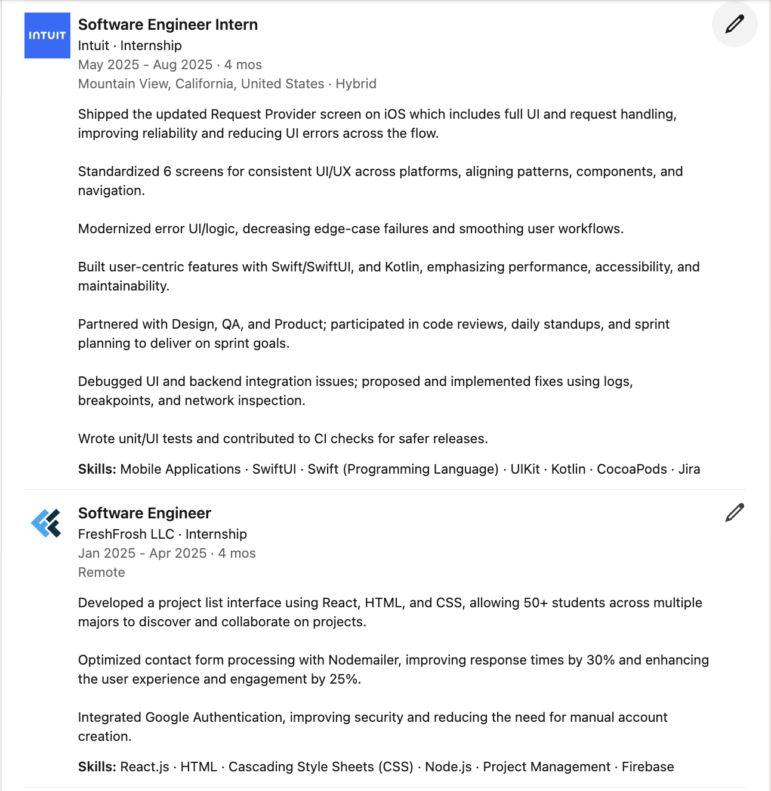

# 💼 progsu LinkedIn Guide

LinkedIn can feel confusing and overwhelming at times.
You see people posting "excited to announce.." and you’re just trying to figure out what to even put on your profile. I know because I was that student once.  
But here’s the thing. LinkedIn IS one of the best tools you can use *as a CS student*.
I know it can seem to be about showing off but it’s actually about giving yourself a better chance at being seen.

So let’s talk about how to make your LinkedIn **stronger and cleaner** step by step.
We'll go through each part of your profile, what recruiters actually look for, and how you can make your profile stand out in the tech crowd.

---

## 1. Your Profile Photo & Banner

First impressions matter and your profile picture and banner plays a huge part in this. My first LinkedIn profile picture was a selfie I took in NYC and I didn't think too much of it. Do not do that.

Here’s what works:
- Take it outside with natural light (overcast days are perfect)  
- Simple background, no heavy distractions  
- Look approachable (smile, but don’t force it)  
- Dress how you’d show up to a career fair

You don’t need to rent a studio. A friend with a decent phone camera + portrait mode would be completely fine. Additionally, GSU offers free headshots at their Iris booth in 25 Park Place, which is where I took my current headshots.

**Banner tip:**  
Pick something that fits your vibe. It could be a tech-themed background, your city skyline, or do what I did and pick something minimalist from [Canva](https://www.canva.com/create/linkedin-banners/).

---

## 2. Your Headline

Most people’s headlines are just:  
> “Student at [University Name]”

Having a headline like that makes it harder for recruiters to see you in searches because you lack keywords.

Try this formula:  
**[Your Field/Role] | [Skills/Tech] | [Interest/Goal]**

Bare minimum example:  
> CS Major @ GSU | iOS & Web Dev | AI Enthusiast  

This is short, searchable, and actually says something about you.  
And DO NOT include words like *“aspiring”* or *“future.”*

Now with your improved profile picture, banner, and headline, your profile should look something like this.

## 3. About Section

This is your *personal elevator pitch* which will be a 3–5 paragraph narrative that blends who you are, what you do, and where you’re headed.

**Structure:**
1. Introduce yourself (student, school, passions)
2. Highlight your technical skills & experiences
3. Share what motivates you or what you’re seeking next

**Example:**
> I’m a Computer Science major at Georgia State University with interests in mobile development, AI, and data-driven design. I’ve built projects ranging from iOS apps to deep learning models and enjoy turning creative ideas into impactful tech.  
>  
> I’m currently seeking opportunities to grow as a software engineer and collaborate with teams building innovative solutions.

---

## 4. Featured Section

Show, don’t tell.  
Add visuals or links to:
- GitHub projects
- Personal website or portfolio
- Resume (PDF)
- Articles or research
- Hackathon wins or demo videos

> 📎 Make it easy for recruiters to *see your work immediately.*

---

## 5. Experience Section

Your experience shows your growth and technical journey, even if you’re early in your career.

**Tips:**
- Include all relevant work, internships, research, and club roles.
- Add non-technical work too (shows responsibility and initiative).
- Use short **paragraphs**, not just bullet points:
  1. What was your role and team?
  2. What project did you lead or contribute to?
  3. What impact did it have (metrics, improvements, lessons)?

**Example:**
> **Software Engineering Intern – TechCorp**  
> *May 2025 – August 2025*  
> I collaborated with the data team to build a React-based dashboard for 200+ employees. I optimized API queries, reducing load time by 30%. This project helped improve decision-making speed across departments.

> 💡 Treat *club leadership*, *research*, or *volunteering* as experience if it showcases initiative or teamwork.

After adding and refining your experience, it should look something like this:

---

## 6. Projects Section

Highlight the technical side of your journey.  
Include academic, hackathon, or personal projects where each one tells a story about your skills.

**Format Example:**
> **OGRE – Graduate Record Examination (GRE) Study App**  
> A mobile app that allows undergraduate students to study for the 3 core areas of the GRE.  
> *Tech Stack:* Swift, SwiftUI, Firebase  
>  
> - Designed UI with SwiftUI  
> - Integrated Firebase authentication and real-time data syncronization  
> - Reduced app load time by 15%  
>  
> [🔗 GitHub Repo](https://github.com/) | [🎥 Demo Video](https://youtu.be/)

---

## 7. Skills & Endorsements

Add both **technical** and **soft** skills, and get peers to endorse them.

**Examples:**
- Python, Java, Swift, React, Node.js  
- Git/GitHub, SQL, Firebase, AWS  
- Communication, Teamwork, Leadership

> ✅ Link each skill to the experience or project where you used it.

---

## 8. Education, Awards, & Extras

Include:
- University, degree, and expected graduation date
- GPA (if 3.5+)
- Coursework (e.g., Data Structures, Algorithms, OS)
- Certifications (AWS, Google Cloud, etc.)
- Hackathon awards or scholarships
- Languages you’re learning or fluent in

> 🏅 Every achievement tells a story

---

## 9. Networking & Growth Strategy

### 🎯 Get 500+ High-Quality Connections
Aim for 500+ *relevant* connections over the next 6–12 months.  
Focus on:
- Engineers and interns at your target companies  
- Recruiters and alumni  
- Hackathon teammates and tech event peers  

> ❌ Avoid mass connecting with randoms because quality beats quantity.

---

### 💎 Consider LinkedIn Premium
LinkedIn Premium gives you:
- Unlimited connection requests
- InMail to message recruiters directly
- Visibility on who’s viewed your profile  

Even one successful referral can easily pay for itself.  
Try it for 3–6 months during recruiting season.

---

### 🔁 Stay Active
Be visible. Spend 10–15 minutes a day engaging:
- Comment, react, and connect genuinely
- Post once a month (hackathon recap, project story, lesson learned)

**Content Ideas:**
- 🎓 What you learned this semester  
- 💡 A new project or feature you built  
- 🧠 Career lessons or reflections  
- 🏆 Event or hackathon recaps  

> Recruiters love seeing students who are *consistently learning and building.*

---

### ✉️ Outreach Tip
Always personalize your connection requests and cold messages and don't be like me and make sure you proofread your message!:
> “Hey [Name], I’m a fellow CS student and really enjoyed your post about [topic]. Would love to connect and learn more about your work at [company].”

---

### 10. Common LinkedIn Mistakes to Avoid
❌ Selfie profile pics
❌ "Aspiring" anything
❌ Having the "Open to Work" banner visible to the public (set to recruiters only)
❌ One-line About sections
❌ Empty Featured Section
❌ No Project links
❌ Connecting with everyone on Earth
❌ Never updating your profile

## 11. Optimization Checklist

| Area | Goal | Complete? |
|------|------|------------|
| Profile Photo | Clear, friendly, and professional | ☐ |
| Banner | Clean, contrasting tech-related image | ☐ |
| Headline | Confident and keyword-rich | ☐ |
| About Section | 3–5 paragraph personal story | ☐ |
| Featured | Projects, resume, or portfolio linked | ☐ |
| Experience | Detailed, impact-focused narratives | ☐ |
| Projects | Include GitHub or demo links | ☐ |
| Skills | 10+ listed with endorsements | ☐ |
| Education | Coursework & certifications listed | ☐ |
| Connections | 500+ high-quality connections | ☐ |
| Activity | Engage and post regularly | ☐ |

---

## 12. Keep It Updated

> Update your LinkedIn every semester! Add new projects, courses, and milestones.  
> A growing profile shows recruiters you’re active, learning, and serious about your craft.

---

## 🚀 Final Thoughts

- LinkedIn + Resume = Your leverage engine.  
- Every interaction can be a *warm lead* to an opportunity.  
- Build it once, update it often, and let it work for you.

> 🎯 **Goal:** Make recruiters say, “I want to talk to this person.”

---

### 📚 Resources

- [LinkedIn Student Learning Center](https://university.linkedin.com/linkedin-for-students)  
- [Canva LinkedIn Banner Templates](https://www.canva.com/create/linkedin-banners/)  
- [Rezi LinkedIn Headline Generator](https://www.rezi.ai/tools/linkedin-headline-generator)  
- [Awesome GitHub Profile READMEs](https://github.com/abhisheknaiidu/awesome-github-profile-readme)  
- [LinkedIn Premium Info](https://www.linkedin.com/premium/)  

---
### written by Brian Johnson
